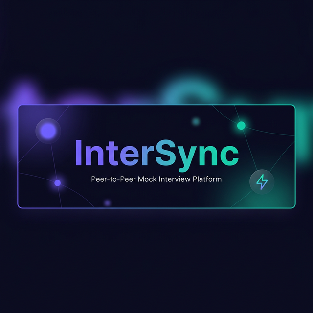

<p align="center">
  
</p>

<h1 align="center">⚡ InterSync</h1>
<p align="center">
  <strong>Peer-to-Peer Mock Interview Platform</strong><br/>
  <em>Match with peers, practice interviews over live video, and get AI-powered resume feedback.</em>
</p>

<p align="center">
  
  
  
  
  
  
</p>

---

## 📖 Table of Contents

- [About](#-about)
- [Features](#-features)
- [Tech Stack](#-tech-stack)
- [Project Structure](#-project-structure)
- [Getting Started](#-getting-started)
- [Environment Variables](#-environment-variables)
- [API Reference](#-api-reference)
- [Socket Events](#-socket-events)
- [Premium Membership](#-premium-membership)
- [Screenshots](#-screenshots)
- [License](#-license)

---

## 🚀 About

**InterSync** is a full-stack web application that connects job seekers for peer-to-peer mock interviews. Users can match with peers based on their skills and target companies, conduct **live video interviews** via WebRTC, rate each other, and use an **AI-powered resume analyzer** powered by Google Gemini. A **premium tier** (via Razorpay) unlocks unlimited resume analysis and an exclusive interview question bank.

---

## ✨ Features

### 🎯 Core Features
| Feature | Description |
|---|---|
| **Skill-Based Peer Matching** | Find interview partners based on overlapping skills and target companies |
| **Real-Time Video Calls** | WebRTC-based peer-to-peer video calls with Socket.io signaling |
| **Online Presence** | Live online/offline status indicators for matched peers |
| **Peer Rating System** | Rate your interview partner (1–5 stars) after each session |
| **Leaderboard** | Top 10 users ranked by number of interviews given and average rating |

### 🤖 AI-Powered
| Feature | Description |
|---|---|
| **Gemini Resume Analyzer** | Upload a PDF resume and get an AI-generated score, strengths, weaknesses, and keyword analysis |
| **Usage Limits** | Free users get **3 analyses**; Premium users get **unlimited** |

### 💎 Premium (₹499 via Razorpay)
| Feature | Description |
|---|---|
| **Unlimited Resume Analysis** | No cap on AI resume reviews |
| **Exclusive Question Bank** | Curated interview questions with hints across JavaScript, React, System Design, MongoDB & Behavioral categories |
| **Premium Badge** | Visible ⭐ badge on leaderboard and profile |

### 🔐 Auth & Security
| Feature | Description |
|---|---|
| **JWT Authentication** | Secure token-based auth with 24-hour expiry |
| **Password Hashing** | bcrypt with 10 salt rounds |
| **Razorpay Signature Verification** | HMAC-SHA256 payment validation |

---

## 🛠 Tech Stack

### Backend
- **Runtime:** Node.js
- **Framework:** Express 5
- **Database:** MongoDB with Mongoose 9
- **Real-Time:** Socket.io 4
- **AI:** Google Gemini 2.5 Flash (`@google/genai`)
- **Payments:** Razorpay
- **Auth:** JWT + bcrypt
- **File Upload:** Multer (in-memory, PDF only, 5MB limit)
- **PDF Parsing:** pdf-parse

### Frontend
- **Rendering:** Static HTML / Vanilla JavaScript
- **HTTP Client:** Axios (CDN)
- **WebRTC:** SimplePeer
- **Styling:** Custom CSS with glassmorphism, dark theme, micro-animations
- **Font:** Inter (Google Fonts)

---

## 📂 Project Structure

```
InterSync/
├── backend/
│   ├── app.js                     # Express server + Socket.io setup
│   ├── package.json
│   ├── .env                       # Environment variables
│   ├── controllers/
│   │   ├── userController.js      # Signup, Login, Profile, Rating, Leaderboard
│   │   ├── matchController.js     # Skill-based peer matching
│   │   ├── resumeController.js    # Gemini AI resume analysis
│   │   └── paymentController.js   # Razorpay order & verification
│   ├── models/
│   │   └── userModel.js           # Mongoose User schema
│   ├── routes/
│   │   ├── userRoutes.js          # /api/users/*
│   │   ├── matchRoutes.js         # /api/match
│   │   ├── resumeRoutes.js        # /api/analyze-resume
│   │   └── paymentRoutes.js       # /api/payment/*
│   ├── middleware/
│   │   └── auth.js                # JWT authentication middleware
│   ├── socket/
│   │   └── roomHandler.js         # Socket.io event handler (calls, presence)
│   └── utils/
│       └── db.js                  # MongoDB connection
│
└── frontend/
    ├── views/
    │   ├── login.html             # Login page
    │   ├── signup.html            # Registration with skills & target companies
    │   ├── dashboard.html         # Main hub: matching, resume analyzer, leaderboard
    │   ├── call.html              # WebRTC video call interface
    │   ├── premium.html           # Premium upgrade page with Razorpay checkout
    │   └── questions.html         # Premium-only interview question bank
    └── script/
        ├── login.js
        ├── signup.js
        ├── dashboard.js           # Peer matching, resume analyzer, leaderboard
        ├── call.js                # WebRTC peer connection & media handling
        ├── premium.js             # Razorpay payment flow
        └── questions.js           # Question bank rendering & filtering
```

---

## 🏁 Getting Started

### Prerequisites

- **Node.js** v18 or higher
- **MongoDB** running locally or a cloud URI (MongoDB Atlas)
- **Razorpay** test/live API keys
- **Google Gemini** API key

### Installation

```bash
# 1. Clone the repository
git clone https://github.com/GirishCPatil/InterSync.git
cd InterSync

# 2. Install backend dependencies
cd backend
npm install

# 3. Configure environment variables (see section below)
#    Edit the .env file with your own keys

# 4. Start the development server
npm start
```

The server starts on `http://localhost:4000`.

### Accessing the App

Open your browser and navigate to:

```
http://localhost:4000/frontend/views/signup.html
```

---

## 🔑 Environment Variables

Create a `.env` file inside the `backend/` directory:

```env
PORT=4000
MONGO_URI=mongodb://localhost:27017/intersync
JWT_SECRET=your_jwt_secret_key
RAZORPAY_KEY_ID=your_razorpay_key_id
RAZORPAY_KEY_SECRET=your_razorpay_key_secret
GEMINI_API_KEY=your_google_gemini_api_key
```

| Variable | Description |
|---|---|
| `PORT` | Server port (default: 4000) |
| `MONGO_URI` | MongoDB connection string |
| `JWT_SECRET` | Secret key for signing JWT tokens |
| `RAZORPAY_KEY_ID` | Razorpay API Key ID ([Dashboard](https://dashboard.razorpay.com/)) |
| `RAZORPAY_KEY_SECRET` | Razorpay API Key Secret |
| `GEMINI_API_KEY` | Google AI Studio API key ([Get one here](https://aistudio.google.com/app/apikey)) |

---

## 📡 API Reference

### Authentication

All protected endpoints require the `Authorization` header with the JWT token.

```
Authorization: <jwt_token>
```

### User Routes — `/api/users`

| Method | Endpoint | Auth | Description |
|---|---|---|---|
| `POST` | `/api/users/signup` | ❌ | Create a new account |
| `POST` | `/api/users/login` | ❌ | Login and receive JWT + user data |
| `GET` | `/api/users/profile` | ✅ | Get current user profile |
| `POST` | `/api/users/rate` | ✅ | Rate a peer (1–5 stars) |
| `GET` | `/api/users/leaderboard` | ✅ | Get top 10 users by interview count |

### Match Routes — `/api`

| Method | Endpoint | Auth | Description |
|---|---|---|---|
| `POST` | `/api/match` | ✅ | Find a peer by matching skills & target companies |

### Resume Routes — `/api`

| Method | Endpoint | Auth | Description |
|---|---|---|---|
| `POST` | `/api/analyze-resume` | ✅ | Upload PDF resume for Gemini AI analysis (multipart/form-data) |

#### Resume Analysis Response

```json
{
  "success": true,
  "score": 78,
  "suggestion": "Quantify your project outcomes with measurable metrics.",
  "strengths": ["Strong technical skills", "Good project variety"],
  "weaknesses": ["Lacks leadership experience"],
  "foundKeywords": ["JavaScript", "React", "Node.js"],
  "missingKeywords": ["CI/CD", "Agile", "Leadership"]
}
```

### Payment Routes — `/api/payment`

| Method | Endpoint | Auth | Description |
|---|---|---|---|
| `POST` | `/api/payment/create-order` | ✅ | Create a Razorpay order (₹499) |
| `POST` | `/api/payment/verify` | ✅ | Verify payment signature & upgrade to Premium |

---

## 🔌 Socket Events

InterSync uses **Socket.io** for real-time features including online presence tracking and WebRTC call signaling.

### Client → Server

| Event | Payload | Description |
|---|---|---|
| `register_online` | `{ userId, userName }` | Register user as online |
| `check_online_status` | `{ peerId }` | Check if a specific peer is online |
| `request_call` | `{ targetUserId, callerName, callerId, signalData }` | Initiate a call request |
| `accept_call` | `{ callerId, receiverId, signalData }` | Accept an incoming call |
| `reject_call` | `{ callerId }` | Reject an incoming call |
| `webrtc_signal` | `{ targetUserId, signal }` | Relay WebRTC ICE candidates |
| `end_call` | `{ targetUserId }` | End an active call |

### Server → Client

| Event | Payload | Description |
|---|---|---|
| `user_status_change` | `{ userId, status }` | User came online/offline |
| `online_status_result` | `{ peerId, isOnline }` | Response to status check |
| `online_users_list` | `[userId, ...]` | List of currently online users |
| `incoming_call` | `{ callerId, callerName, signalData }` | Incoming call notification |
| `call_accepted` | `{ signalData, receiverId }` | Call was accepted by the receiver |
| `call_rejected` | `{ message }` | Call was declined |
| `call_ended` | `{ message }` | Peer ended or disconnected from the call |
| `call_failed` | `{ message }` | Target user is offline |

---

## 💎 Premium Membership

| | Free | Premium (₹499) |
|---|---|---|
| Peer Matching | ✅ | ✅ |
| Video Calls | ✅ | ✅ |
| Peer Rating | ✅ | ✅ |
| Leaderboard | ✅ | ✅ |
| Resume Analysis | 3 uses | ♾️ Unlimited |
| Question Bank | ❌ | ✅ |
| Premium Badge | ❌ | ⭐ |

---

## 📸 Screenshots

> 💡 *Screenshots coming soon — run the app locally to explore the full UI!*

---

## 📄 License

This project is licensed under the **ISC License**.

---

<p align="center">
  Built with ❤️ by <strong>Girish C Patil</strong>
</p>
